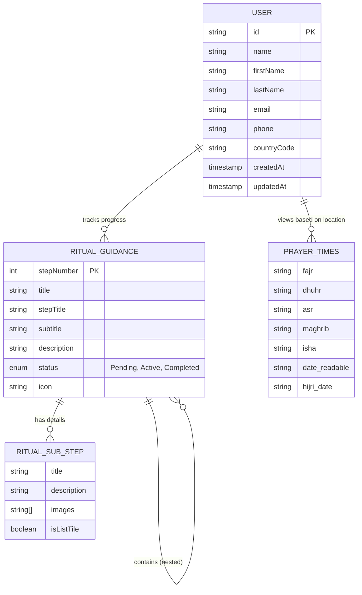

1. Data Model & Entity Relationship Diagram (ERD)

## 1.1 Overview

The Labbaik application utilizes a flexible, document-oriented data structure designed to support the dynamic nature of the Hajj and Umrah pilgrimage journeys. The data model is centered around the **User**, their **Progress**, and the hierarchical **Ritual Guidance** content.

## 1.2 Core Entities

### 1. User (`UserModel`)

Represents the pilgrim registered in the system. Stored in the `users` collection in Firestore.

- **Attributes**:
  - `id` (PK): Unique identifier (String).
  - `name`: Full display name (String).
  - `firstName`, `lastName`: structured name components (String).
  - `email`, `phone`: Contact information (String).
  - `countryCode`: User's country (String).
  - `profilePicture`: URL to profile image (String, Optional).
  - `dateOfBirth`: User's DOB (String).
  - `emailVerified`: Verification status (Boolean).
  - `createdAt`, `updatedAt`: Timestamps.

### 2. Ritual Guidance (`RitualGuidance`)

A hierarchical, recursive entity representing the steps of Hajj and Umrah. This is primarily **static content** defined in the app but tracks user status dynamically.

- **Attributes**:
  - `stepNumber`: Order of the step (Int).
  - `title`: Main title (e.g., "Tawaf") (String).
  - `stepTitle`: Label for the step (e.g., "Day 8") (String, Optional).
  - `subtitle`: Secondary title (String, Optional).
  - `description`: Main instructions (String).
  - `subDescriptions`: List of additional text paragraphs (List<String>).
  - `icon`: Asset path for the icon (String).
  - `status`: Dynamic status (Pending, Active, Completed, None) - _derived from User Progress_.
- **Structure**:
  - `nestedSteps`: List of `RitualGuidance` objects (Recursive).
  - `subSteps`: List of `RitualGuidanceSubStep` objects (Granular details).

### 3. Ritual Sub-Step (`RitualGuidanceSubStep`)

Represents granular details or specific actions within a main ritual step.

- **Attributes**:
  - `title`: Action title (String).
  - `description`: Specific instruction (String, Optional).
  - `images`: List of image asset paths (List<String>).
  - `steps`: List of bullet points or sub-instructions (List<String>).
  - `isListTile`: Rendering hint (Boolean).

### 4. Prayer Times (`PrayerTimes`)

Stores calculated prayer timings and date information (Hijri/Gregorian).

- **Attributes**:
  - `timings`: Object containing `fajr`, `sunrise`, `dhuhr`, `asr`, `maghrib`, `isha`, `midnight`, `sunset`.
  - `date`: Contains `readable`, `timestamp`, `hijri` (detailed), and `gregorian` (detailed) dates.
  - `meta`: Location and calculation method metadata.

## 1.3 Entity Relationship Diagram

## 1.4 Schema Design Decisions

1.  **Recursive Guidance Structure**: The `RitualGuidance` entity uses a recursive design (`nestedSteps`) to accurately model the Hajj timeline. For example, "Day 8" is a parent step that contains nested steps like "Ihram" and "Mina".
2.  **Separation of Content and Progress**: While `RitualGuidance` defines the _content_ (what to do), the _status_ (Pending/Completed) is derived from a user-specific progress map (e.g., `Map<int, bool>`). This allows the content to remain static while the user's journey is personalized.
3.  **Rich Sub-Steps**: `RitualGuidanceSubStep` allows for flexible content presentation, supporting simple text, lists of instructions, or image galleries (e.g., for Ihram garments).
